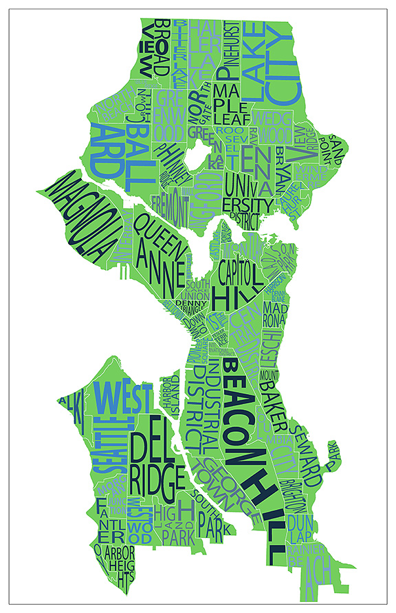

Guide for Transplants
=====================

Congratulations and welcome to Ada Developers Academy! This guide was written by a few transplants of Ada Cohort 3. We thought it would have been nice to have an orientation packet to help us move from our current homes to Seattle, so here it is. First of all, this is a huge step and while it may seem scary, try not to fret. You have a lots of supporters at Ada Developers Academy and hopefully this guide will help you get started. If you'd like more personal help or to chat one on one, feel free to contact any of the people listed at the bottom of the document. We're here to help!g

Things You'll Need
------------------
Seattle’s weather and terrain may be different than your home’s so make sure to include the following in your luggage:

- **Rain Jacket(s)**  
  Though great brand name ones can be thrifted right here in Seattle.

- **Comfortable Shoes**  
  Get ready to climb those hills! Maybe once you’ve got your city feet you can wear those pretty heels again.

- **A Bike?**  
  Maybe reconsider bringing your car. Parking is tough and can get really expensive. Plus, Seattle is relatively bike friendly.  
  [Read our in-depth biking guide here](/car_to_bike.md)

Housing
-------
**My Lease Doesn’t Begin Until After I Arrive… Am I Homeless?**  
Nah, girl! We wouldn’t leave you stranded like that. Ada should have a Housing Committee of volunteers from past cohorts who are willing to house you while you look/wait for housing. Be clear whether you’re bringing a pet or are a smoker, since it might violate the terms of their lease. And don’t forget to thank your host before moving into your new place!

**Seattle's 20 Day Notification**  
Apartment renters are required to notify their landlords of their departure from the apartment 20 days prior to actually vacating. This means that the apartments that show up for rent (especially the good ones) are not on the market for very long. Many times, landlords will have open houses for the vacant apartment.

**Garbage**  
Seattle likes to be green and keep the Earth happy. Because of this, it is a legal requirement for people to both recycle and compost in addition to just regularly throwing things away. Recycling is in the blue bin and compost in the green bin. Recycling, regular trash, and compost are all picked up by the waste department.

- microhousing or apodments
- realtors
- avg pricing of apartments by neighborhood  
  - [A Week of Mining Seattle's Craigslist Apartment Pricing](http://www.racketracer.com/2014/12/23/a-week-of-seattles-craigslist-apartment-pricing/)
    - Expected Rental Price equation from the article   
      SQFT = square footage in hundreds  
      BATH = # of bathrooms  
      BED = # of bedrooms  

      RENT = Base Price of neighborhood ($X) + (SQFT * 69.68) + (BATH * 322) + (BED * 107)

      For example, a 500sqft. 1bdr/1bath apartment in U-District would be approx.  
      $1368.40 = Base Price of U-District (591) + (5 * 69.68) + (1 * 322) + (1 * 107)
- neighborhood map
- location of school
- craigslist, padmapper
- transplants from cohort[2]
- transplants from cohort[1]
- transplants from cohort[0]
- moving your things
- shopping for furniture
- Ask landlords for videos of apartments

[Padmapper](http://www.padmapper.com/search/apartments/Washington/Seattle/)  
[Craigslist - Seattle](http://seattle.craigslist.org/)  
[Lee & Associates](http://www.leeandassociatespm.com/)  
[Windermere Property Management](http://www.wpmnorthwest.com/rentals)  
[Hamilton Urban Partners](https://www.hamiltonurban.com/residents/listings/seattle/)

Getting Your Things to Seattle
------------------------------
- USPS
- UPS
- Amtrak
- luggage
- Moving companies

Neighborhoods
-----------

  

**Pioneer Square**  
Very eclectic neighborhood. Lots of homeless. The oldest neighborhood in Seattle!

**Capitol Hill**  
Known as the most LGBT friendly neighborhood. Tons of cool shops and restaurants. Likely to be a bit obnoxious on weekend nights. Very expensive in terms of housing. Expect to pay about $2000/month for a one bedroom apartment.

  - *Tacos Chukis | 219 Broadway E (Upstairs)*  
    Best tacos! And cheap! Totally has that delicious hole-in-the-wall vibe.

  - *Julia’s on Broadway | 300 Broadway E*  
    Not known for its food, but for its shows! Every Friday and Saturday Julia’s hosts Le Faux Show, a drag show of “outrageous celebrity impersonations.” Sunday brunch is taken over by a never-repeated drag show hosted by Kristie Champagne.

**South Lake Union**  
Home of Amazon. Bro-town. Basically where the Amazon-ians go to breed. Feels like a Seattle neighborhood that was bleached years ago. 

**Lower Queen Anne**  
Quieter more chill area of Seattle, that's a little more pricey. Located right by Seattle Center (home of EMP Museum and the Space Needle).

**Belltown**  
Right next to downtown Seattle, so it's wonderfully located. Lots of restaurants, bars, shops and very walkable. Mostly flat, unlike other neighborhoods. Can get a bit rowdy and some complain that's it's sketchy.

**Central District**  
Info about CD

**First Hill**  
Info about First Hill

**Fremont**  
Info about Fremont

**Ballard**  
Info about Ballard

Getting Around
--------------

**ORCA LIFT**  
So… you’re poor! Since it’s likely you’ll have zero income once attending Ada, it’s nice to know there are some perks with falling below the poverty line. The first of few is reduced bus fare ($1.50 compared to the regular $2.50 and $2.75 during peak hours)! Since this is such a great perk, you know there’s a ton of bureaucracy behind it. To apply for a reduced fare bus pass (the ORCA LIFT card), you’ll need to stop by one of these enrollment offices (during their very restricted hours) and provide proof of your eligibility and your identity. We’ll warn you now: they’re very picky of how you prove your eligibility. If last year’s taxes don’t fall under the line of double poverty level ($23,540 for single household; $31,860 for two) then you’ll need to submit a request for your employment history (which can be done at the enrollment office). Expect it to take about a week, but you can ask the enrollment office to mail your ORCA LIFT card to your home so you don’t have to find another time to visit before their 5 PM closing.  

Note: If you’re applying for the free Apple Care healthcare (which you can do at some of the ORCA LIFT enrollment offices), you’ll be able to skip this step since your lack of income will be verified then.

- biking
  - tips/tricks?
- transit
  - ORCALift passes and how to obtain one
    - apps to help you get around
  - bus
  - train
- car
- walk
- ferry

Buying a Laptop
---------------
- Student discount
- Apple discount
- Macbook Pro
- Macbook Air
- Macs in General  

[Apple Refurbished](http://store.apple.com/us/browse/home/specialdeals/mac)

HealthCare
----------
- Your options [Washington Apple Health - Medicaid](http://www.hca.wa.gov/medicaid/Pages/index.aspx)
- Signing up

Bringing a Pet
--------------
*If you’re bringing a pet...*

Think twice. Ada is a full-time commitment and you’ll likely stay after class to finish writing a program or will want to hang out for happy hour or to attend a meet-up. Expect to be home just enough to eat and sleep (you’ll have more time than that, but it’s smart not to count on it). Dogs will need more attention than you might have, so consider the well-being of your pet. Cats, birds, fish, etc. will be more forgiving that you’re not home at least eight hours a day.

If you do decide to bring your pet, consider how you’re relocating to Ada. If you’re driving, make sure to pack food, water, and make regular stops for them to do their business. Also make sure to find rest stops and/or hotels that allow for pets.

If you’re flying, get ready to pay. Most airlines charge a $100 fee for bringing pets on-board. The fee may vary if the pet is with you in the cabin or stowed in cargo. You’ll also need a clean bill of health from your vet to show the airline per your destination’s requirements. Washington state requires a health certification and current rabies shots. Visiting the vet isn’t cheap; check if your airlines offers a coupon for the health certification and/or visit. Whether your pet is traveling in cabin or cargo, they’ll need a carrier that abides by the airline’s regulations. Check the airline website for specifics (e.g. hard/soft carrier, requires food/water, allowed dimensions, etc.). Check these requirements weeks before your flight! You might need to order your carrier online. If your pet is traveling with you in cabin, consider buying them a leash. TSA will make you take your pet out of its carrier to walk through the X-ray scanner and you don’t want to chase a pet around an airport. If your pet is flying with you in cabin, don’t forget to call the airline within 24 hours of your flight to reserve your pet’s place. Only so many pets can fly in cabin and you don’t want to leave them behind if you don’t have the right carrier for cargo.

Flying or driving, consider buying a calming spray or wipes to help your pet cope with traveling. They’re likely to be frightened and scared, so bring treats and remember to check in with them often.

Asking Questions
----------------
- Email
- Twitter
- We moved too! We can help answer questions if you have them
  - Person 1
  - Person 2
  - Person 3
  - Person 4
  - Person 5

Quitting your Job
-----------------
- Advice

How We Got to Seattle
---------------------
- Flying or driving?

I’M IN SEATTLE!...Now What?
---------------------------
Get settled, girl! Consider planning an IKEA trip with your other cohort transplants to get some furniture in your new space. Explore your neighborhood and get familiar (walking around is the best way). And don’t forget to do these easy-to-forget-but-damn-totally-necessary things:

  - **Change your mailing address!**  
    USPS will charge you $1.50 to change your mailing address online, but it’s so worth it. They’ll forward your mail from your old address for about six months and they’ll also notify those sending you mail that your address has changed to the new address. (Also don’t forget to update your bank/investment info, Netflix account and social media profiles.)

  - **Register to vote!**  
    Since you changed your permanent address, you’ll have to register to vote. Don’t forget to do this! Your vote is important!! 

  - **Get Internet! Cable! Utilities!**  
    If your building doesn’t handle all your utilities, make sure to set them up ASAP. You don’t want to be left without WiFi for weeks! Your building manager should have a list of companies who provide for your location.

  - **Get a library card!**  
    The Seattle Public Library is an amazing public service (the central branch is 11 stories!) with many local branches that may be in your neighborhood. All you need is proof of a local mailing address (bring in a piece of mail or a copy of your lease) and you’ll have access to all the things!

  - **Update your driver's license**
    What's the timeline?

  - 
